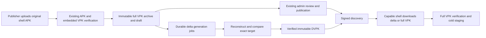

# Paravoid DVPK implementation plan

Status: implemented in LelloStore on 2026-10-02, except the installed-device
gate (see [Implementation status](#implementation-status)). No deployment, app
publication or rollout is implied by this document.

## Outcome

Publishers upload an embedded-payload Paravoid shell APK. LelloStore extracts its
already developer-signed full VPK, archives it, and optionally generates direct
deltas from earlier archived VPKs. Updated shells download a useful delta,
reconstruct the exact target VPK, verify it, and stage it for cold activation.
Every target remains downloadable as a full VPK.

The shell implementation is in Paravoid commit `33340c6`, **Add DVPK shell
delivery and APK-only distributor specification**. The authoritative protocol is
[Paravoid DVPK.md](../../paravoid-android/DVPK.md), alongside
[the complete VPK contract](../../paravoid-android/V1.md). Pin that implementation
when vendoring conformance fixtures; this remains an unreleased extension.

Success means the app publisher uploads APKs only, old shells continue to receive
valid full-only discovery, and new shells can update through Store-generated
DVPKs with the existing authorization, signature and lifecycle guarantees.

## What already exists

The following was inspected in this repository while preparing this plan. Reuse
these paths rather than introducing a second publishing or verification pipeline.

| Existing component | Responsibility | DVPK change |
| --- | --- | --- |
| `backend/src/services/shells.rs` | Verifies original APK signatures/policy, rejects personalized originals, extracts and verifies embedded VPKs | Keep this as the input authority; test its output feeds generation |
| `backend/src/services/upload.rs` | Stores embedded payload and registers the APK draft | Enqueue eligible generation without changing upload success or review semantics |
| `backend/src/services/vpks.rs` | Immutable full VPK storage under `vpks/<sha256>.vpk`, release insertion | Reuse exact verified bytes and identity; add a separate delta artifact store |
| `backend/src/db/paravoid.rs` and migrations | Contracts, releases, streams and revisions | Add durable patch/job records and discovery representation state |
| `backend/src/services/upload_jobs.rs` | Durable validation worker and restart recovery | Reuse queue conventions; keep expensive delta work from blocking upload validation |
| `backend/src/api/delivery.rs` | Authenticated discovery, signed-head caching and artifact delivery | Negotiate offers, handle replay-safe revisions, serve DVPKs |
| `backend/src/api/routes.rs` | Existing `/api/paravoid/v1/...` delivery routes | Register the delta endpoint below |
| `backend/src/paravoid/metadata.rs` | Strict authenticated metadata parser | Extend `ArchiveOffer` and release-field validation before signing delta heads |
| `backend/src/services/retention.rs` | Transfer-copy and orphan cleanup | Extend for delta artifacts and worker temporary files with explicit retention rules |
| `scripts/check-paravoid-*.sh`, `backend/tests/paravoid_*` | Upstream, HTTP and installed-device acceptance | Add protocol and device DVPK cases |

APK-only embedded-payload ingestion already works: see
[PARAVOID_DELIVERY.md](PARAVOID_DELIVERY.md). Empty-bootstrap installers retain
their existing separate-payload path; they contain no VPK to extract. Keep that
existing functionality, but do not describe it as the new APK-only flow.
Ordinary APKs do not become Paravoid payloads automatically.

## Release flow



Full publication never waits for delta generation. Generating a delta does not
publish an app, approve a draft, change the selected payload, or sign a new VPK.
Only offers for already published and verified targets may reach discovery.
LelloStore uses its discovery signing key; it needs no developer release key.

## 1. Persist artifacts and jobs

Add a migration and DB helpers for a `vpk_deltas` table and a durable generation
queue. Names below are proposed implementation names, not required wire fields.

| Record | Required information |
| --- | --- |
| Delta relationship | App, shell contract, base/target release references, exact base/target archive hashes and sizes, algorithm |
| Verified artifact | Patch SHA-256 and size, immutable storage path, verification timestamp and encoder version |
| Job | Stable deduplication key, state, attempts, bounded failure reason, timestamps, claim/recovery information |

Use a uniqueness constraint on app/contract/base hash/target hash/algorithm.
Different jobs must not replace an existing verified relationship with different
bytes. Distinguish queued/running/ready/skipped/failed; expose only `ready`
artifacts that passed reconstruction. A skipped patch is a normal optimization
outcome, not a failed APK upload or app publication.

Store patches under `dvpks/<patchSha256>.dvpk`. Follow full VPK publication's
temporary-file, fsync, immutable-link and destination hash/size check pattern.
Commit the ready DB reference only after the file is durable. Reconcile orphaned
files after interrupted publication. Keep full archives intact.

## 2. Generate and verify direct patches

Start with **the previous published compatible VPK to the new target**, then
optionally the two preceding compatible published bases. This is a bounded
initial policy, not a protocol restriction. Both archives must belong to the same
app and installed shell contract, be verified, and have usable original bytes.
Do not infer patch identity from APK versionCode, payload version alone, R8
mapping, or module dependency graphs.

For a target already published when a job becomes ready, schedule a discovery
revision update. For an unpublished draft, hold the patch until ordinary target
publication. Later, backfill popular older bases using aggregate request metrics;
never create unbounded jobs directly from arbitrary client hash headers.

Use a dedicated bounded worker or lower-priority queue. Cap concurrent work,
input sizes, resident memory, CPU/time and temporary disk use. Recover interrupted
claims after restart and deduplicate enqueue attempts. Generation failure must
leave full delivery available. Retry transient failures with bounded backoff;
record insufficient savings and impossible/oversized patches as skipped.

Initial encoder choice: use Paravoid's
[reference Python encoder](../../paravoid-android/delivery/tools/dvpk.py) in a
controlled worker environment with `bsdiff4==1.2.6`. A Rust encoder is also valid,
but must pass the same Java decoder tests. The reference tool consumes memory
proportional to input sizes and is not a verifier for arbitrary untrusted inputs.

```sh
python3 -m venv /tmp/lellostore-dvpk-tools
/tmp/lellostore-dvpk-tools/bin/pip install bsdiff4==1.2.6
/tmp/lellostore-dvpk-tools/bin/python ../paravoid-android/delivery/tools/dvpk.py \
  BASE.vpk TARGET.vpk OUTPUT.dvpk
```

The CLI prints the patch descriptor and target hash/size. Pass immutable verified
paths as structured process arguments; require successful exit, valid bounded
output, matching inputs and independent reconstruction verification. Do not trust
JSON stdout alone as publication authority.

Before marking a patch ready:

1. Recheck base and target exact sizes and hashes.
2. Apply it to the base with an independent decoder, including the Paravoid Java
   decoder in the interop gate.
3. Require exact target bytes, size and SHA-256. The target's existing developer
   signature and compatibility verification must also remain valid.
4. Require `patchSize <= targetSize - ceil(targetSize / 5)`, matching the shell's
   20% savings threshold, and the format bounds below.
5. Publish immutable bytes and only then make the ready relationship visible.

## 3. Negotiate signed discovery safely

Capable shells send:

```http
X-Paravoid-Dvpk: bsdiff-deflate-v1
X-Paravoid-Base-Sha256: <selected full VPK lowercase SHA-256>
```

The base header is optional and is only a selection hint. Reject malformed or
duplicate supported negotiation headers consistently; unknown capability values
can receive the legacy representation. It is not a grant, entitlement check or
permission to request arbitrary stored artifacts.

Legacy requests must receive the existing release object with **no `deltas`
field**, including no empty field. Old shells reject unknown signed fields.
Capable AVAILABLE responses may include ready patch descriptors:

```json
{
  "algorithm": "bsdiff-deflate-v1",
  "baseArchiveSha256": "<64 lowercase hex characters>",
  "baseArchiveSize": 5500000,
  "patchSha256": "<64 lowercase hex characters>",
  "patchSize": 850000
}
```

Place them in `release.deltas` inside the existing signed head body. Preserve all
five target release identity fields. At most 16 offers, no duplicate
`(algorithm, baseArchiveSha256)`, no unverified files or unpublished targets.
Extend Rust's strict parser, manual release-field checks and signing verification
path together; `ArchiveOffer` currently denies unknown fields. Keep strict
validation rather than accepting arbitrary additional JSON.

### Head revisions are a required design step

The current head cache in `api/delivery.rs` keys on SDK/ABIs within a stream
revision. Adding offers selected from request headers cannot simply reuse that
key. Moreover, a different cache key alone is insufficient: the shell's
authenticated request scope does not include the DVPK headers, and a new signed
body at an already observed revision can be rejected as conflicting history.

Recommended first implementation: return a deterministic, bounded list of ready
deltas to capable clients for each target/capability scope, and let the shell
choose its exact base. Keep `X-Paravoid-Base-Sha256` as an advisory metric for now;
do not produce per-base signed bodies yet. This avoids changing discovery when
the selected base changes after cold activation.

Persist separate full-only and capable representations with **distinct durable
head revisions**, allocated monotonically as part of a discovery epoch. For
example, allocate the legacy revision first, then the capable revision, and make
the next epoch's allocations greater than both. Audit existing stream revision,
trust minimum and cached-head schema before choosing the concrete migration.
Account for first enablement, refresh, delayed patch readiness, rollback and
full-only-to-capable client transitions. Never recompute two bodies under one
already used scope/revision, reset a revision counter, or use the APK version as
the head revision. If choosing a different design, prove the same invariants in
the actual Paravoid admission tests before exposing offers.

Cache keys must distinguish capability representation in addition to existing
scope/revision. ETags are hashes of the exact signed envelope, and 304 reuse must
preserve its original expiry. Add
`Vary: X-Paravoid-Dvpk, X-Paravoid-Base-Sha256` alongside existing authorization
variation where relevant. Patch readiness, removal and policy changes must
advance applicable discovery revisions before changing signed content. A rollback
removes offers through a new revision; it does not restore an older head.

## 4. Serve DVPKs through existing delivery authorization

Add this route under Store's existing delivery base `/api/paravoid/`:

```text
v1/apps/<applicationId>/releases/<targetReleaseId>/deltas/<baseArchiveSha256>/payload.dvpk
```

Reuse target-release access rules, grant expiry/revocation, public/keyed policy,
same-origin delivery and existing publication checks. Bind the lookup to the
authorized app, target and contract relationship; a global hash lookup is not
authorization. Return 404 when there is no eligible ready relationship and
401/403 for existing authentication-denial cases.

Successful responses must have:

```http
Content-Type: application/vnd.paravoid.dvpk
Content-Encoding: identity
ETag: "<patchSha256>"
Content-Length: <exact response byte count>
```

For a full 200 response the byte count is the signed patch size. For 206 it is
the range length, with strict `Content-Range` identifying the complete signed
patch size. Reuse Range/If-Range/416 behavior from the full artifact path. Do not
redirect the shell to storage URLs, recompress bytes, or rewrite the artifact.
The full endpoint and its VPK MIME type remain available.

## 5. Format and client behavior to implement against

| Rule | Required value |
| --- | --- |
| Algorithm | `bsdiff-deflate-v1` |
| Magic | 8 ASCII bytes `DVPKD001` |
| Header | Magic, control compressed length, difference compressed length, target size; total 32 bytes |
| Integer encoding | Signed 64-bit little-endian two's complement |
| Blocks | Separate raw DEFLATE control, difference and literal streams; no zlib/gzip wrapper |
| Control record | `(add, copy, seek)`, 24 bytes |
| Base/target size | 1 byte through 1 GiB |
| This codec's patch size | 38 bytes through 256 MiB |
| Control record bound | 1,000,000 |
| End conditions | Exact target length; all streams fully consumed; no trailing compressed bytes or cursor overflow |

This is **not BSDIFF40**. BSDIFF40 uses bzip2 blocks and sign-magnitude integers;
convert it using the reference encoder or implement the specified codec directly.
Follow [DVPK.md](../../paravoid-android/DVPK.md) for arithmetic, negative seeks,
outside-base zero bytes and strict termination.

The shell tries one direct eligible patch, requires at least 20% savings, and
falls back to the full target for missing/corrupt bases or unavailable/invalid
patches. Auth denial, cancellation and stale/expired admission do not start a
fallback transfer. The result always undergoes ordinary full-VPK verification
and staging; no live patching or delta chain exists. Feed/custom transports
remain full-only. R8 needs no configuration change for correctness: compare and
patch final optimized VPK bytes. Savings may vary with optimizer output.

## 6. Retention, operations and publisher experience

Keep the current original APK and full-VPK retention guarantees. Patches are
optional derived artifacts; do not delete bases or targets just because a patch
exists. Generation workers need protected immutable inputs until verification
finishes. Cleanup must coordinate with jobs and open downloads.

Initially retain a small number of recent direct patches per target. Remove
offers through a new discovery revision before making their files unavailable;
allow a grace period for still-valid signed heads and in-flight downloads. Full
delivery remains the repair path if an optional patch is lost. Never mark a
missing/corrupt file ready indefinitely.

Expose patch/job state, failures, base/target identities, wire size, savings,
encoder version and generation duration in admin diagnostics. Add aggregate
delta/full transfer metrics, fallback reasons and worker resource usage without
logging credentials. Publisher UI and CLI need no DVPK upload step; preserve
ordinary APK draft review and publication. Optional delta generation failures
should appear as diagnostics, not an unusable application release.

## Acceptance gates

| Gate | Required evidence |
| --- | --- |
| APK-only ingestion | Two embedded-payload APK uploads create exact verified full archives without separate VPK/DVPK uploads; reject wrong policy/signature/duplicate carrier; empty shell retains its old explicit path |
| Codec interoperability | Store-generated patches applied by Paravoid Java reconstruct actual developer-signed VPKs exactly; both valid target and incompatible target exercise ordinary full verification |
| Generation recovery | Duplicate enqueue, concurrent claim, worker death, retry, memory/time limit and insufficient savings preserve full delivery and avoid partial ready artifacts |
| Discovery compatibility | Legacy strict verifier accepts a head without deltas; updated verifier accepts descriptors; malformed/duplicate/oversized fields are rejected |
| Replay/cache | Capability upgrade, changed selected base, delayed patch readiness, new target, refreshed expiry, concurrent heads and rollback never reuse a conflicting scope/revision; ETags and 304 behavior remain exact |
| Artifact transport | Public/keyed cases, revoked/expired grants, wrong app/target/base, MIME/hash/size, ranges/If-Range/416, missing and corrupt patches |
| Shell fallback | Unsupported codec, less than 20% savings, missing/corrupt base, unavailable/malformed patch fall back; auth/cancel do not |
| Installed-device flow | Real HTTPS Store: install updated shell A, publish B through APK-only ingestion, fetch DVPK, stage B while A remains active, cold-launch B, verify preserved app data and offline launch |
| Regression | Existing APK acquisition/personalization, full VPK delivery, publication review, empty bootstrap, push hints and distribution migration gates still pass |

Reuse `backend/tests/paravoid_distribution.rs`, `paravoid_metadata.rs`,
`paravoid_archive.rs`, `upstream_paravoid.rs` and the existing script/device test
support. Add a DVPK-focused suite and an interop script rather than claiming
coverage from new unit tests alone. Pin matching Paravoid fixtures/source in
`scripts/vendor/paravoid` according to its existing workflow.

Paravoid's host delivery/lifecycle/contract tests and Android runtime build passed
for this implementation, including bounded Python/Java decoding and signed VPK
verification. These are not evidence of Store-generated DVPK delivery on a device;
that final gate belongs to the combined implementation.

## Suggested implementation sequence

1. **Protocol and persistence:** extend strict metadata models, migrate artifact
   and job records, settle revision/cache representation design and its tests.
2. **Worker:** generate from existing immutable VPKs, independently reconstruct,
   enforce savings and limits, publish ready records, test restart recovery.
3. **Artifact serving:** authenticated DVPK route, exact headers and ranged
   transfers; keep offers disabled while this is being validated.
4. **Discovery:** capability negotiation, deterministic offers, durable distinct
   revisions, precise cache validators, readiness-triggered refresh.
5. **Operations:** retention, diagnostics, metrics, bounded retries and admin
   visibility; generation never gates full publication.
6. **Acceptance and rollout:** upstream codec gate, full regression suite, real
   Store HTTPS device test, then enable for a small set of compatible contracts.

Use separate flags for generation and advertising. Roll out with generation on
and advertising off first, inspect exact reconstruction and savings, then enable
offers for verified targets. Roll back advertising through fresh signed revisions
while keeping full artifacts served. No backend deployment, app publication or
publisher workflow migration is authorized merely by this planning document.

## Implementation status

| Area | Where |
| --- | --- |
| Persistence | `migrations/2026100201_vpk_deltas.sql`, `src/db/dvpk.rs`: one deduplicated row per job/relationship; `paravoid_streams.dvpk_advertising` |
| Codec and parser | `src/paravoid/dvpk.rs` (bounded independent decoder), `release.deltas` validation in `src/paravoid/metadata.rs` |
| Worker | `src/services/dvpk.rs`: vendored `dvpk.py` subprocess with rlimits, report check, independent reconstruction, immutable publication |
| Enqueue | Embedded-payload registration, VPK upload jobs and publication (`publish_tx`, before replacement) |
| Discovery | `src/api/delivery.rs`: negotiation, two revisions per epoch, `Vary`, offers only for capable shells with advertising on |
| Transport | `.../deltas/<baseArchiveSha256>/payload.dvpk`; missing patches are withdrawn through a new revision |
| Operations | Retention, 24-hour grace, input pinning, admin **Deltas** tab, Prometheus metrics, Docker venv; see [PARAVOID_DELIVERY.md](PARAVOID_DELIVERY.md#dvpk-delta-delivery) |
| Tests | `backend/tests/paravoid_dvpk.rs`, `scripts/check-paravoid-dvpk.sh`, `scripts/tests/StoreDvpkCheck.java` |

Head representation decision: each discovery epoch allocates `R` (full-only) and
`R + 1` (capable). Every invalidation or expiry refresh advances by two, and a change
of the configured advertising flag also starts a new epoch, so a shell upgraded
from a full-only to a capable APK observes a strictly greater revision and no
scope/revision pair is ever signed twice with different bytes.

Open gates: the Store-backed installed-device DVPK flow (install updated shell A,
publish B through APK-only ingestion, fetch the DVPK, stage and cold-launch B) has
not been run. Aggregate fallback reasons are client-side and not reported to the
Store. Patches per target are bounded by the retained base window
(`PARAVOID_DVPK_RETAINED_BASES`, default 3): while generation is on, replacement keeps
that many previously published archives stored as bases instead of deleting them.
