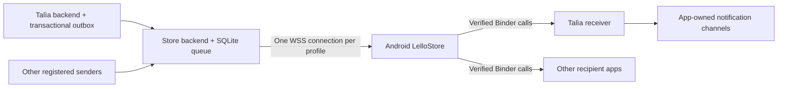

# Shared Android notifications through LelloStore

Version 1, 2026-09-29. Implemented behind `NOTIFICATIONS_ENABLED=true`.
Device qualification is required before production rollout; no measured battery
or Doze latency claim is made by this document.

## Architecture and trust

The Rust Store backend hosts the queue and notification APIs at the existing
public HTTPS origin, `https://store.lelloman.com`. Android Store owns one WSS
connection per Android user/profile. Participating apps use the shared Binder
client library and post their own Android notifications. No Firebase, system
privilege, root, automatic broker election, or UnifiedPush compatibility is used.

**The self-hosted server and Android Store can read notification contents.**
HTTPS/WSS protects transport. Payloads are ordinary JSON, not end-to-end encrypted
ciphertext. Application databases and server backups must be protected as other
private application data. Payloads and bearer credentials must not enter logs.



Sender service authentication is separate from recipient authentication. A
sender credential never authenticates a phone, a user, or an administrator.
Recipient identities use the canonical OIDC issuer and subject, not email.
Version 1 implements the same-account assumption: the app backend's authenticated
recipient issuer/subject must match the Store installation's issuer/subject.
Personal and work profiles have separate installations, credentials and sockets.

## Sender provisioning and administration

An administrator opens **Notifications** in the Store web UI and creates a
30-minute, one-use invitation scoped to recipient package names and approved
current signing-certificate SHA-256 digests. A sender persists a randomly
generated 256-bit credential and registration ID **before** redeeming the
invitation. Retrying the same registration is idempotent. The server stores
credential hashes; it does not need recoverable sender secrets.

The sender registers its message types, allowed levels, type defaults and
ordered matching rules. Administrators can add ordered policy overrides, change
package/certificate scopes, suspend delivery, cancel pending messages, rotate
credentials with a 24-hour overlap, and revoke a sender. Removing a package or
pin revokes affected subscriptions. Revocation invalidates credentials and
subscriptions and cancels queued messages. Administrative changes are audited.

Publication policy precedence is:

1. First matching administrator override.
2. First matching sender rule.
3. Registered message-type default.

Rules match an application, optional type, optional level, and all specified
tags. Effective policy/version and expiration are frozen at acceptance. Changing
policy affects future publications; cancelling pending messages is a separate
operation. LelloStore is also a built-in sender for `catalog.changed` latest-state
hints and uses the same connection when background notifications are enabled.
The legacy foreground catalog endpoint remains available.

## Enrollment and authorization leases

1. The recipient calls `NotificationClient.beginSession(issuer, subject)` after
   authenticating with its own backend. Local installation/generation state and
   received messages live in `noBackupFilesDir`.
2. The SDK binds explicitly to Store. Both sides verify the actual Binder UID,
   unambiguous package ownership and approved current signing certificates.
   Shared UIDs and unknown signing keys are rejected.
3. Store verifies the exported receiver component and obtains a five-minute
   enrollment proof using its own authenticated device registration.
4. The recipient submits that proof to its own backend over its authenticated
   session. The backend independently authorizes the user and redeems the proof
   with its sender credential and canonical recipient identity.
5. Store binds local confirmation to the verified package, certificate, receiver,
   installation and generation. A different local app cannot confirm that route.
6. The backend renews the subscription's five-minute authorization lease every
   two minutes. Renewal happens on the backend, not by polling from the phone.

Delivery pauses while a lease is expired; retained backlog remains queued.
Revocation cancels backlog. Talìa renews only while its native session remains
valid and its user retains administrator access to reports/incidents. Provider
unavailability fails closed. Store authenticates the WSS stream with both a
device credential and a current OIDC token, and closes it at token expiration.
Upstream Store-account revocation is bounded by the JWT lifetime; there is no
claim of immediate provider introspection by the Store backend.

Local sign-out invalidates generation/presentation state before network cleanup.
Store retires its encrypted device credential and persists offline revocation
work for a subsequent connection. Force-stop requires reopening the app.

## Delivery policies and receipts

| Strategy | Behavior |
| --- | --- |
| `queue`, positive TTL | Each event is retained until recipient persistence or expiry. |
| `queue`, null TTL | Until delivered, subject to queue quotas and explicit cancellation/revocation. |
| `latest` | Latest `(occurrence, revision)` wins for subscription/type/replacement key. |
| `online_only` | Accepted only for a live authorized connection; never replayed on a later connection. |

Producer expiry can shorten server retention, not extend it. A reused event ID
with different content is rejected. Retrying identical content returns the same
outcome. Fan-out, replacement, watermark updates and quota checks are atomic.
Quota failure does not partially publish or delete the previous latest state.

Latest-state watermarks survive payload expiry. Reconnect reconciliation sends
bounded state snapshots so a superseded or expired recovery can clear an older
posted incident. The receiver compares occurrence/revision before presentation;
old snapshots cannot cancel newer state.

Store durably stages an envelope, then binds the verified recipient for a bounded
operation. The SDK persists/deduplicates it before returning `persisted`. Only
then does Store acknowledge durable delivery to the server. Presentation has a
separate result: `posted`, `suppressed`, `permission_blocked`, `expired`, or
`superseded`. Store retains local recovery markers until presentation settles.
A socket write or Binder dispatch alone is not delivery.

Stable Android notification tags and `onlyAlertOnce` make normal retries quiet.
There is no exactly-once sound guarantee across a process crash between posting
and recording presentation. Notification taps reopen normal authenticated app
flows and never carry sender credentials or authorize an action by themselves.

## Resource limits

- Application payload: 16 KiB; JSON HTTP bodies and WSS frames: 64 KiB.
- Default sender quota: 100,000 pending deliveries, 256 MiB queued payload.
- Global queued payload ceiling: 1 GiB.
- Sender token bucket: 10 publications/second, burst 100; administrator configurable.
- 32 outstanding server deliveries/device, interleaved across recipient packages.
- At most 64 active subscriptions/device and 256 latest-state keys/subscription.
- At most four concurrent local Binder deliveries, each bounded to ten seconds.
- Terminal event/receipt retention: 30 days; latest-state watermarks persist.
- Administrative audit retention: latest 10,000 records.

Unlimited TTL does not mean unlimited capacity. Senders keep their own durable
outbox, use stable event IDs, and back off on unavailable/capacity responses.

## Android lifecycle and adaptive heartbeat

The user enables **Shared notifications** and grants unrestricted battery use.
Store uses a `specialUse` foreground service with an ongoing status notification,
network-change callbacks, explicit alarm scheduling, and bounded operation wake
locks. It never holds a permanent wake lock. Boot, unlock and package-replacement
receivers restore an opted-in connection after credential-protected storage is
available. The stop action turns off the preference.

Heartbeat learning uses monotonic time and separate Wi-Fi, cellular, VPN and
other-network categories. Cached learning expires after seven days:

- Initial idle interval: five minutes; lower bound one minute; upper bound fifteen.
- Three qualifying idle successes increase the interval by 2%.
- A classified idle timeout reduces it by 20% after reconnection demonstrates
  reachability on the same network.
- Acknowledgement deadline: 90 seconds.
- Traffic-active samples, alarms over ten seconds late, network changes and
  server outages do not count as successful idle-learning samples.
- Reconnect uses exponential jittered backoff, bounded to five minutes.

Battery exemption permits network/partial-wake-lock use during Doze, but does not
promise exact alarm timing on every device. Android documents limits on
while-idle alarms; the implementation records alarm lateness and excludes those
samples from learning. Authentication renewal can also shorten an otherwise idle
interval. The heartbeat target is therefore not a universal Doze latency SLA.
See [Android Doze restrictions](https://developer.android.com/training/monitoring-device-state/doze-standby)
and [AlarmManager](https://developer.android.com/reference/android/app/AlarmManager).

## HTTP and WSS contract

All paths below are relative to `/api/notifications/v1`. Credentials belong in
headers, never URLs. Sender endpoints use `Authorization: Bearer <sender-secret>`.
Device management/enrollment use the Store OIDC bearer and, after registration,
`X-Device-Credential`. Self-revocation accepts the device bearer alone.

| Method/path | Purpose |
| --- | --- |
| `POST /senders/register` | Redeem invitation with persisted registration ID/credential. |
| `PUT /sender/manifest` | Register types, defaults and ordered rules. |
| `POST /sender/rotate` | Idempotently install a successor credential. |
| `POST /devices` | Register Store installation under its authenticated user. |
| `DELETE /device` | Revoke the credential's own device and subscriptions. |
| `POST /enrollments` | Issue a locally verified enrollment proof. |
| `POST /subscriptions` | Sender redeems proof with authorized issuer/subject. |
| `POST /subscriptions/{id}/confirm` | Device confirms exact local enrollment identity. |
| `POST /subscriptions/renew` | Sender renews authorized subscriptions, batches up to 1,000. |
| `DELETE /subscriptions/{id}` | Owning sender/device revokes a subscription. |
| `POST /messages` | Publish idempotent typed JSON message. |
| `GET /messages/{event_id}` | Sender reads per-subscription outcomes. |
| `GET /stream` | WSS, subprotocol `lellostore.notifications.v1`. |

The WSS upgrade uses the device bearer. Within ten seconds the client sends
`{"kind":"authenticate","access_token":"..."}`. Only successful user
validation displaces an older connection. Server frames are `ready`, `routes`,
`snapshots`, `delivery`, `pong`, `authenticated`, and `receipt_ack`. Client frames
are `authenticate`, `ping` with a nonce, and `receipt` with delivery ID and optional
presentation. Routine lease renewals do not emit phone traffic.

Example sender manifest and message:

```json
{
  "types": [{
    "application": "com.lelloman.talia", "name": "incident.state",
    "levels": ["info", "warning", "critical", "error"],
    "default": {"strategy": "latest", "ttl_seconds": null}
  }],
  "rules": []
}
```

```json
{
  "event_id": "host-7-occurrence-3-revision-2",
  "application": "com.lelloman.talia", "type": "incident.state",
  "target": {"subject": "canonical-user-subject"},
  "level": "info", "tags": ["incident"], "occurred_at": 1790700000,
  "replacement_key": "host-7", "occurrence": 3, "revision": 2,
  "payload": {"key": "host-7", "active": false, "summary": "Recovered"}
}
```

Use current epoch seconds for `occurred_at`; this example is illustrative.
Unknown types/levels, scope violations, stale identity and oversized payloads
are rejected. Admin endpoints live under `/api/admin/notifications` and require
the existing Store administrator role, independently of sender credentials.

## Talìa integration and local build

Talìa's migration 019 adds subscription/outbox tables and transaction-bound
triggers for report completion and incident transitions. Report previews
(`send=false`) do not publish. Report severity remains distinct from execution
status. Incidents use replacement keys with occurrence/revision ordering;
recovery and acknowledgement suppress the old Android notification.

The Talìa worker is disabled unless `TALIA_STORE_NOTIFICATIONS_FILE` names a
private writable configuration file. Initial contents:

```json
{
  "url": "https://store.lelloman.com",
  "invitation": "ADMIN_CREATED_ONE_TIME_INVITATION",
  "applications": ["com.lelloman.talia"]
}
```

The worker persists its generated sender credential before registration and
removes the invitation afterward. Keep the file and its directory private and
writable by the service account. On administrator credential rotation, replace
the file's `credential` and restart the worker before the overlap expires.

Build the shared artifacts into the Store build directory, without publishing
outside the workspace:

```sh
cd android
./gradlew :notification-protocol:publishReleasePublicationToMavenRepository \
  :notification-client:publishReleasePublicationToMavenRepository
```

Talìa resolves `com.lelloman.store:notification-client:0.1.0` from that local
repository (override with `LELLOSTORE_NOTIFICATION_REPOSITORY`). Supply trusted
Store signing pins in `LELLOSTORE_SIGNING_CERTIFICATES`, comma-separated lowercase
SHA-256 hex, when building Talìa. An unconfigured build cannot enroll. Approve
Talìa's own release signing pin in its sender invitation. Do not substitute debug
certificates in production.

Talìa APK 4 adds a receiver and notification permission. This requires a **new
signed shell APK**, not a payload-only update to APK 3. Establish an APK-4
Paravoid baseline as part of the separately authorized release process. Use
`-PparavoidNewShell=true` only when building/exporting that new shell; ordinary
payload builds continue to require the accepted APK-4 baseline. No
release or deployment is part of this implementation.

The `notification-fixture` Android module is an independent manual recipient.
Build with `-PfixtureStoreCertificate=<debug-Store-SHA256>`; it binds only the debug
Store package. Enter the canonical identity, copy the generated proof to an
authenticated fixture backend/operator, redeem it, and enter the returned
subscription ID to confirm. It has no sender secret or persistent network loop.

## Operations and qualification

Enable the backend feature flag only after migrating SQLite and configuring
normal OIDC validation. Existing catalog APIs remain available. The reverse
proxy must preserve WSS upgrades and allow idle connections longer than the
chosen heartbeat plus acknowledgement deadline. Server process restart replays
retained deliveries after authentication and repairs Store catalog hints.

The administrator page exposes connected devices and delivery outcome counts.
Metrics include `lellostore_notification_connections`,
`lellostore_notification_deliveries{state}`,
`lellostore_notification_pending_bytes`, and
`lellostore_notification_oldest_pending_seconds`. Background maintenance samples
these once a minute. Android records heartbeat interval, RTT and alarm lateness
in its private broker diagnostics; the foreground notification shows connection
and setup status.

Automated checks cover policy precedence, durable replay, idempotency, atomic
fan-out quotas, recovery watermarks, credential separation, enrollment account
and generation binding, authenticated WSS receipts, heartbeat learning, and
Talìa transactional outbox behavior. Android instrumentation tests cover durable
recipient storage, generation changes and signing identity checks; they require
a device/emulator to execute.

Before rollout, record results for two recipients under: ordinary screen-off,
forced Doze and maintenance windows, Wi-Fi/cellular transitions, interrupted
server/OIDC access, boot/unlock, broker and recipient process death around each
receipt boundary, permission denial, logout/account switch, signing changes,
uninstall/reinstall, force-stop/reopen, queue expiry and incident recovery.
Compare an overnight no-broker baseline with an idle connected run and a
controlled message run. Record battery use, transferred bytes, reconnects,
wakelock time, alarm lateness and delivery latency. `adb devices` showed no
attached device during implementation; those measurements remain unperformed.
